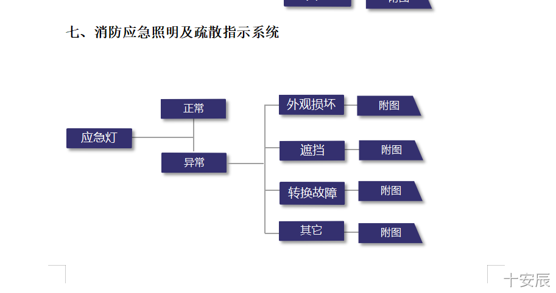
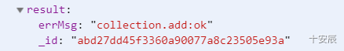
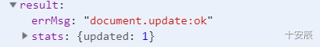
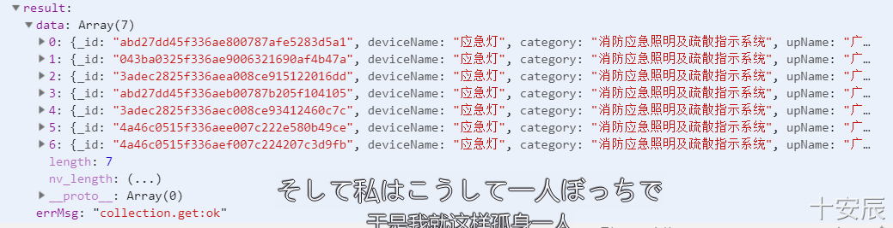
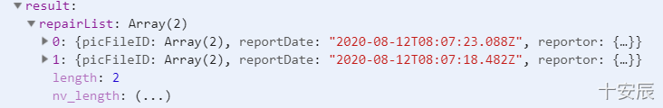

# 消防设备维修微信小程序

## 一、项目目录

- cloudfunctions ： 后端接口，云函数文件
- miniprogram：小程序前端

## 二、公司接口设计

### 1、companyAdd（）√

项目管理员创建下属公司
传入参数：

- companyName：本公司名称
- newCompanyName：新公司名称
- adminNum：需要新建的管理员人数
- level：2或者3，2表示是母公司的合作公司，3表示甲方公司
- startDate：合作起始日期
- endDate：合作终止日期
- device：公司所使用的设备
- companyIntro：公司简介**（可选）**
- companyContent：具体内容**（可选）**

返回值：一个对象{
code:以数组的形式返回adminNum个管理员密码（注册码），可用于管理员注册，每个码可用一次，创建失败则返回空数组 [ ],
company:新公司的所有信息
}

### 2、regist（）√

用户第一次注册时使用，会绑定用户的openid、姓名、电话、注册日期
传入的参数：

- code：邀请注册的密码，此密码只能使用一次，成功注册一次密码之后便会失效
- name：姓名
- phone：电话

返回此人的全部信息，已经注册或者密码错误返回null

### 3、getPositon（）√

用于获取此人的职位，用于判断是否具有管理员权限
传入参数：无
返回值：一个对象，如果此人不存在，就返回

### 4、memberaAdd（）√

用于管理员添加本公司的成员，生成一个密码（注册码），使用前请先判断此用户是否是本公司管理员
传递参数：

- position:职位

返回值：一个对象{
		code :可以用于新成员注册的密码，一次性使用
		positon：职位
}
没有生成密码失败则返回空对象 { }

### 5、companyQuery(）√

返回公司除members（成员信息）外的所有信息

- companyName：公司名称

返回值：一个对象，公司所有信息，若是公司不存在则返回null

### 6、membersQuery（）√

返回公司所有members信息
传入参数：

- companyName：公司名称

返回值：公司所有成员信息，一个对象数组

### 7、getCompanyList（）√

获取指定公司类别的列表
传入参数：

- level：需要获取的公司的列表的等级，1表示母公司列表，2表示合作公司列表，3表示甲方公司列表

返回值：一个对象数组每个对象为

{ 
      companyName：公司名称
      companyInfo：{
                                  startDate：起始时间
     							 endDate：结束时间
      							routineDate：每月维修日期
		}
}

### 8、memberDel（）√

用于删除员工
传入参数：

- _openid：要删除的用户的 _openid

返回值：一条是否删除成功的信息

上面的地址应该是address而不是adress，维保人员信息应该是repairer而不是Repairer

## 三、设备列表接口

### 1、 deviceAdd()√

用于添加公司需要维护的设备，类别category对应上图消防应急照明及疏散指示系统这一级，设备名称对应应急灯这一级，会设置normal字段为false，完成设备维修后则改为true
传入的参数：

- deviceName：设备名称
- category：设备所属类别
- upName：母公司或者合作公司的名称（负责维修的公司）
- errContent：故障详情，这是一个数组
- downName：使用设备的甲方公司的名称
- picFileID：一个数组，每个元素都是图片的fileID
- crood：设备的经纬度坐标，数组 【经度，纬度】，此格式不可出错，请注意
- address：设备的详细地址，字符串
- name：报修人员姓名
- phone：保修人员手机号

返回值：设备id，例如

### 2、 deviceDel()√

用于完成设备维修，会将normal字段修改为true，表示设备正常，
传入的参数：

- _id：设备的id
- name：维修人员的名字
- phone：维修人员的手机号

返回值：添加的情况，stats：{ updated: 1}表示成功完成此设备的一次维修申请

stats：{ updated：0}表示删除失败或者数据库中没有此条数据

### 3、deviceQuery()√

查询公司的设备所有设备的维修记录
传入的参数：

- companyName：设备所属公司的名称，甲方或者合作公司、母公司皆可
- normal：bool对象，传入false表示查询此公司需要维修的设备记录，true表示已经维修好的设备

返回值：对象数组，每个对象都是一个维修记录，例如

### 4、queryByID√

通过id查询此维修记录的所有维修信息
传入的参数：

- id：维修记录的id

返回值：一个对象，此维修记录的所有信息

### 5、getDivceList√

获取公司所有的设备维修记录的列表
传入参数：

- companyName：公司的名称

返回值：对象数组，每个对象都为
{
		_id，
        deviceName,
        category，
        normal，
        reportDate
}，会包含设备id、设备名称、设备类别，设备是否正常、报修日期五项属性

### 4、repairQuery（）

查询设备的维修记录
传入的参数：

- _id：设备的id

返回值：一个对象数组，数组中的每个对象都是一条维修记录信息，例如

### 5、applicationAdd（）

用于甲方公司报修，添加一个维修记录，会修改 normal 为 false，表示设备有问题需要维修，新的维修记录永远会添加在repairList的首部
传入的参数：

- _id：设备的id
- errInof：故障信息，可以有多个，这个是一个数组
- picFileID：故障的照片，可以有多个，这是一个数组
- name：报修人员姓名
- phone：报修人员手机号

返回值：添加的情况，stats：{ updated: 1}表示成功添加一条维修申请

stats：{ updated：0}表示删除失败或者数据库中没有此条数据

### 6、applicationComplete（）

用于母公司或者合作公司维修设备后，标记完成设备维修，会修改 normal 为 true 表示设备正常
传入的参数：

- _id：设备的id
- name：维修者名称
- phone：维修者手机号

返回值：添加的情况，stats：{ updated: 1}表示成功添加一条维修申请

## 四、数据库设计

### 1、项目列表

存储了所有甲方公司的信息已经本公司对接人员

1. id：项目id
1. 项目名称：甲方公司名称
1. 项目负责人：本公司对接小组负责人
1. 项目成员：对接小组
1. 项目具体信息：注册日期

### 2、身份数据表

存储了所有注册用户的身份信息

- 甲方报修人员
- 维保人员
- 维保主管
- 老板

主要信息：

1. _id：记录id
1. openid：用户唯一标识符号
1. nickName：昵称
1. jobs：职位
1. regestrationDate：注册日期

### 3、消防设备信息

消防设备具体信息，这里的数据需要根据具体情况修改

1. _id：记录id
1. number：设备编号
1. category：类别
1. deviceQRCode：设备二维码
1. **GeoPoint**：地点
1. maintenanceDuration：维保时长
1. company：公司
1. repair：是否需要维修

### 4、报修记录

1. _id：记录id
1. number：设备编号
1. deviceQRCode：设备二维码
1. **GeoPoint**：地点
1. imageFile：图片地址，url
1. details：具体情况，字符串
1. progress：维修进度，已维修或者未维修
1. failureDate：故障日期
1. repairDate：维修日期